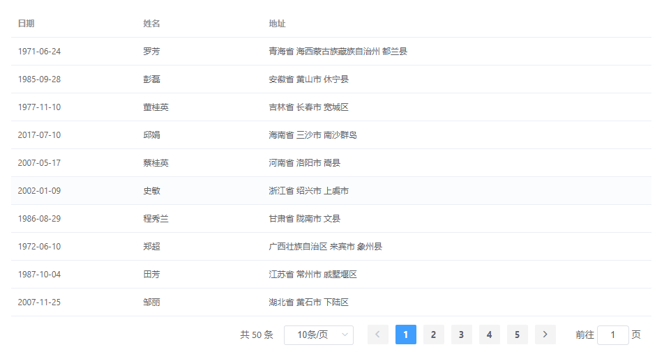

# vue-element-table

> 基于 Vue 2 和 Element-ui@2.x 的可自由定制的、带有分页功能的 Table 组件.

[英文文档](README.md)

## 简单示例

```
<template>
    <ve-table :data="tableData" :columns="columns"></ve-table>
</template>

<script>
    import Mock from 'mockjs';

    export default {
        data() {
            return {
                tableData: (() =>
                    {
                        const data = [];
                        for (let i = 0; i < 50; i++) {
                            data.push(Mock.mock({
                                date: '@date',
                                name: '@cname',
                                address: '@county(true)'
                            }))
                        }
                        return data;
                    }
                )(),
                columns: [
                    {
                        prop: 'date',
                        label: '日期',
                        width: 180
                    },
                    {
                        prop: 'name',
                        label: '姓名',
                        width: 180
                    },
                    {
                        prop: 'address',
                        label: '地址',
                    }
                ]
            }
        }
    }
</script>
```

你将获得如下效果。



更多详细内容参考 [vue-element-table](https://liaoct.github.io/vue-element-table/).

## 安装

```bash
yarn add @liaoct/vue-element-table
```

## 用法

### 全量引入

在 main.js 中:

```js
import VeTable from '@liaoct/vue-element-table';
import '@liaoct/vue-element-table/dist/VeTable.css';

Vue.use(VeTable);
```

上面的代码会将 VeTable 全部引入，但是不要忘了 CSS 文件要单独引入。

现在你可以按如下方式进行使用:

```vue
<ve-table :data="data"></ve-table>

<ve-table-sync :http-request="request"></ve-table-sync>

<ve-tree-table :data="data"></ve-tree-table>
```

### 按需引入

<b>Todo.</b>

## 开发步骤

```bash

# 安装依赖
yarn

# 压缩打包
yarn run build

# 自动格式化代码
npm run lint

# 运行测试
yarn run test

```

获取更多详细信息或帮助，请联系 <www.389055604@qq.com>。
