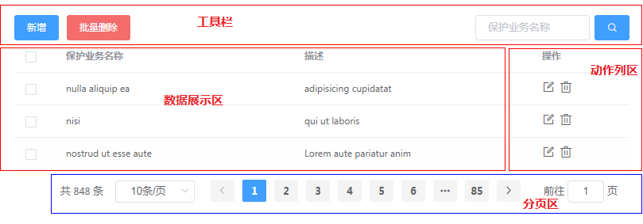

# 组件布局

## 基础布局

本组件由以下三部分组成：

- 工具栏
- 表格
    - 数据展示区
    - 工作列区
- 分页栏

## 工具栏

工具栏是完全用户自定义的区域，通常情况下`工具栏`应该是独立在表格之外的，但是有时候我们希望工具栏和表格合在一起，使具有清晰的
组件，或者便于封装成业务组件。如果有需要，可以使用[具名插槽](https://cn.vuejs.org/v2/guide/components-slots.html)将`工具栏`插入到`vue-element-table`中。具体内容参考[工具栏](/zh/tool/)章节。

## 表格

实际上就是`el-table`的封装，具有和`el-table`完全一样的功能，如果你不了解[el-table](http://element-cn.eleme.io/2.0/#/zh-CN/component/table)请阅读其文档。

## 数据展示区

数据展示区和动作列区都属于表体部分，只不过数据展示区专门用来展示数据，列动作区用来放置常见的`查看`、`删除`等功能按钮。

## 动作列区

大多数业务场景都有对数据项的`查看`、`删除`等功能，这里将这部分功能抽象为动作区，用于快速创建动作列。实际上使用内置的
`el-table-column`和`el-button`。详细内容参考[动作列](/zh/action-column/)章节。

## 分页栏

实际上是一个内置的`el-pagination`，如果你不了解[el-pagination](http://element-cn.eleme.io/2.0/#/zh-CN/component/pagination)请阅读其文档。分页栏在本库的使用方式请参考[分页栏](/zh/pagination/)章节。
